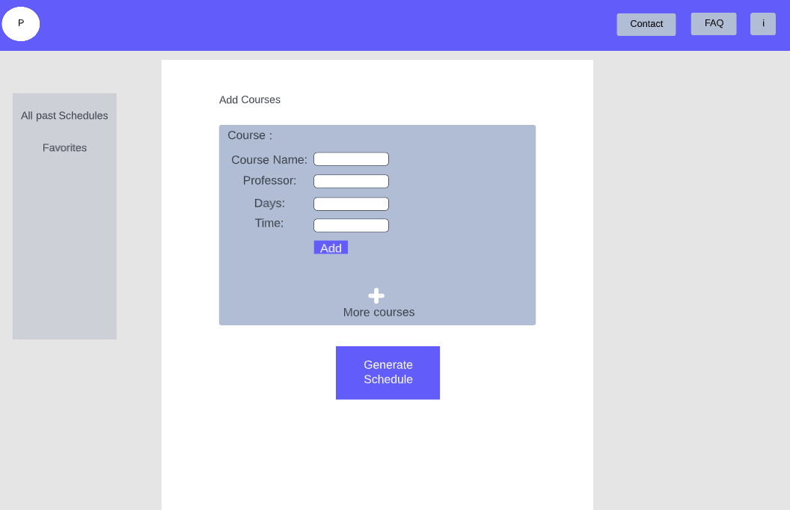

# SCHOOLIE

## Overview

When deciding on which classes to take next semester, your possible schedules grow exponentially with the more classes you have in mind. It is almost impossible to visualize all of the possible schedule even when choosing 4 classes from a possible 10. That would be 210 permutations. 

Schoolie is a schedule generator that will keep the grunt work of creating most of the possible schedules from a set of classes you are interested to take. Users can register and login. Input multiple different classes and Schoolie will create a  schedule for users to save and later choose from many. This web app will generate schedules that do not have time conflicts. Once users choose their favorite schedule they can save them to their personal schedules for them to compare. Students will have a better time deciding on their schedule when they visually see all of their choices. They will be able to search for schedules that contain certain classes, professors, or start after a certain time. 


## Data Model

The web application will store Users, classes, and schedules
  * users can have multiple schedules (via references)
  * each schedule will have multiple classes (via embedding)
  * the classes will contain professor, name, days, and time

(__TODO__: sample documents)

An Example User:

```javascript
{
  username: "studentUser",
  hash: // a password hash,
  schedules: // an array of references to List documents
}
```

An Example Schedules with Embedded Items:

```javascript
{
  user: // a reference to a User object
  Schedule_id: //a number id for the schedule,
  classes: [
    { name: "Intro to CS", professor: "John Johnson", days: "Mon,Thur,Fri", time: 12:00 - 13:15},
    { name: "Writing the Essay", professor: "Jane Janeson", days: "Mon,Wed", time: 8:00 - 9:15},
  ],
  createdAt: // timestamp
}
```


## [Link to Commented First Draft Schema](db.mjs) 


## Wireframes

/schoolie/login - page for login or creating account


/schoolie - home page for schoolie


/schoolie/generateSchedules - page for user to enter classes and generate schedules



/schoolie/schedules - page that lists all of the generated schedules


## Site map


## User Stories or Use Cases

1. as non-registered user, I can register a new account with the site
2. as a user, I can log in to the site
3. as a user, I can add courses to a list
4. as a user, I can generate schedules from a specific number of courses
5. as a user, I can view all schedules generated 
6. as a user, I can favorite certain schedules and save them

## Research Topics
* (2 points) Bootstrap
   * I am going to use bootstrap as a css framework to develop a responsive website
   * Bootstrap provides pre-built HTML, CSS, and JavaScript components that can be customized to create a consistent and
   professional looking interface
   * Bootstrap will help with making my website more accessible to a wide arrange of user displays

* (4 points) Passport 
   * I am going to use passport for authroization and authentication throughout my site
   * Passport allows for user registration and user login to be stored in the database
   * Passport also works with cookies to allow the user to be saved within the session so that they will be authorized to certain routes. Other routes will redirect to login when not authrorized

* (4 points) Deployment
  * I am going to use Amazon web service to deploy my website online
  * AWS has a service called EC2 which allows for clients to use virtual computer on the cloud.
  * The virtual computer runs on linux where i am able to install dependencies, copy my git repo and run my app continously for other users to connect to.


## [Link to Initial Main Project File](app.mjs) 


## Annotations / References Used


1. [passport](https://heynode.com/tutorial/authenticate-users-node-expressjs-and-passportjs/)- used for authenticating a user
2. [bootstrap ](https://getbootstrap.com/2.3.2/components.html)  - front end 
 